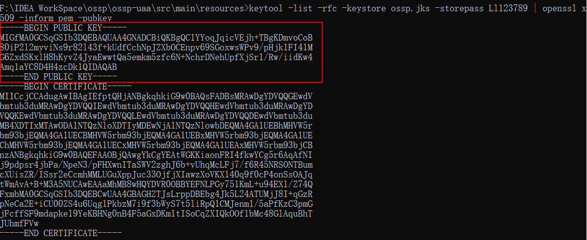

# 统一登录认证中心

## 依赖介绍
```xml
<?xml version="1.0" encoding="UTF-8"?>
<project xmlns="http://maven.apache.org/POM/4.0.0" xmlns:xsi="http://www.w3.org/2001/XMLSchema-instance"
         xsi:schemaLocation="http://maven.apache.org/POM/4.0.0 https://maven.apache.org/xsd/maven-4.0.0.xsd">
    <modelVersion>4.0.0</modelVersion>
    <!-- 统一版本依赖 -->
    <parent>
        <artifactId>ossp</artifactId>
        <groupId>cn.aixuxi</groupId>
        <version>1.0-SNAPSHOT</version>
    </parent>
    <groupId>cn.aixuxi.ossp</groupId>
    <artifactId>ossp-uaa</artifactId>
    <version>0.0.1-SNAPSHOT</version>
    <name>ossp-uaa</name>
    <description>OSSP 用户认证与授权服务</description>
    <properties>
        <java.version>1.8</java.version>
    </properties>
    <dependencies>
        <!-- 引入通用工具依赖 -->
        <dependency>
            <groupId>cn.aixuxi.ossp</groupId>
            <artifactId>ossp-common</artifactId>
            <version>0.0.1-SNAPSHOT</version>
        </dependency>
        <!-- Web核心 -->
        <dependency>
            <groupId>org.springframework.boot</groupId>
            <artifactId>spring-boot-starter-web</artifactId>
        </dependency>
        <!-- 生成验证码 -->
        <dependency>
            <groupId>com.github.axet</groupId>
            <artifactId>kaptcha</artifactId>
            <version>0.0.9</version>
        </dependency>
        <!-- oauth2依赖 -->
        <dependency>
            <groupId>org.springframework.cloud</groupId>
            <artifactId>spring-cloud-starter-oauth2</artifactId>
        </dependency>
        <!-- Cloud Security -->
        <dependency>
            <groupId>org.springframework.cloud</groupId>
            <artifactId>spring-cloud-starter-security</artifactId>
        </dependency>
        <!-- JWT -->
        <dependency>
            <groupId>org.springframework.security</groupId>
            <artifactId>spring-security-jwt</artifactId>
            <version>1.0.10.RELEASE</version>
        </dependency>
    </dependencies>

    <build>
        <plugins>
            <plugin>
                <groupId>org.springframework.boot</groupId>
                <artifactId>spring-boot-maven-plugin</artifactId>
            </plugin>
        </plugins>
    </build>

</project>

```

## 配置文件介绍
```yaml
server:
  port: 8888
spring:
  application:
    # 必须，用于在Nacos服务中区分不同的微服务
    name: ossp-uaa
  datasource:
    # 数据库连接池
    druid:
      url: jdbc:mysql://localhost:3306/security-auth?useUnicode=true&characterEncoding=UTF-8&serverTimezone=UTC&useSSL=false
      username: root
      password: root
      driver-class-name: com.mysql.jdbc.Driver
  cloud:
    nacos:
      discovery:
        # Nacos的服务地址
        server-addr: 114.115.167.133:8848
  redis:
    database: 0
    host: localhost
    port: 6379
    password: ''
mybatis-plus:
  mapper-locations: classpath:mapper/*.xml
```

### JWT的RSA非对称密钥生成

#### 一、生成密钥文件
使用jdk自带的keytool工具，执行后会在当前目录生成 ossp.jks 密钥文件
- 1.执行指令
- 2.输入密钥库口令2次
- 3.输入信息或者直接回车
- 4.“是否正确”输入y
- 5.输入密钥口

```text 
keytool -genkey -alias zlt -keyalg RSA -storetype PKCS12 -keysize 1024 -keystore zlt.jks 
```
- 参数解析
  - genkey：创建证书
  - alias：证书的别名。在一个证书库文件中，别名是唯一用来区分多个证书的标识符
  - keyalg：密钥的算法，非对称加密的话就是RSA
  - keystore：证书库文件保存的位置和文件名。如果路径写错的话，会出现报错信息。如果在路径下，证书库文件不存在，那么就会创建一个
  - keysize：密钥长度，一般都是1024
  - validity：证书的有效期，单位是天。比如36500的话，就是100年
#### 二、提取公钥
```text
keytool -list -rfc -keystore zlt.jks -storepass zlt@123 | openssl x509 -inform pem -pubkey
```
红框的内容就是公钥内容，直接创建一个pubkey.txt文件复制到里面就行了


参数解析:
- keystore：密钥文件
- storepass：密钥密码